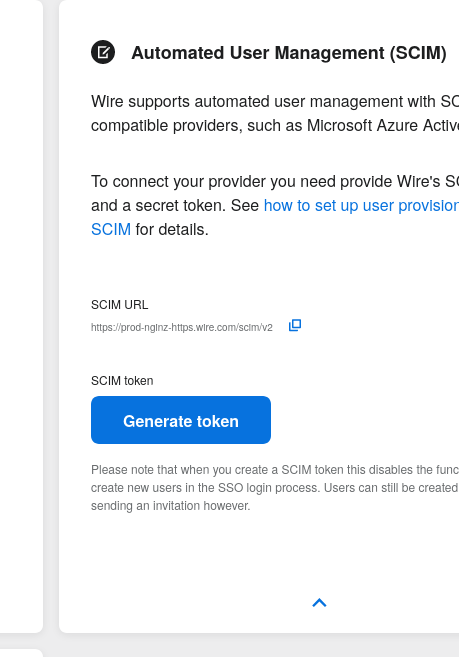
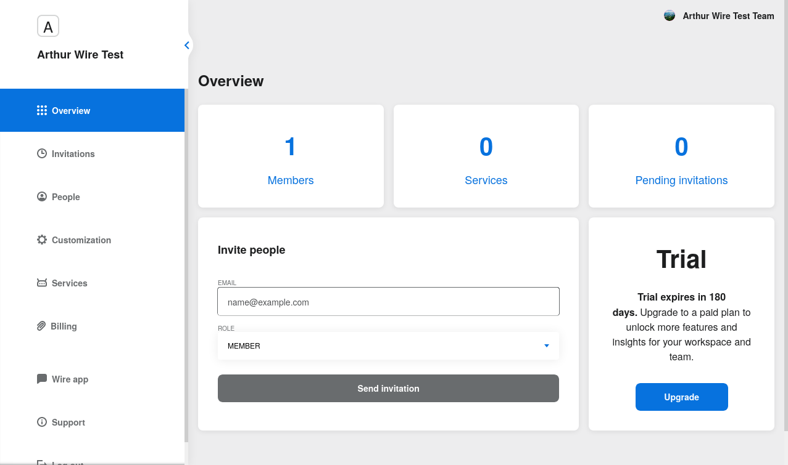
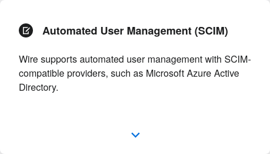
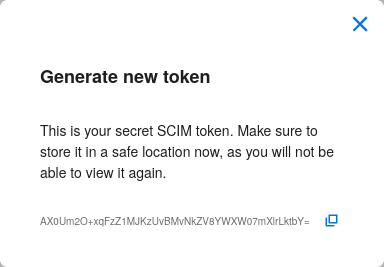
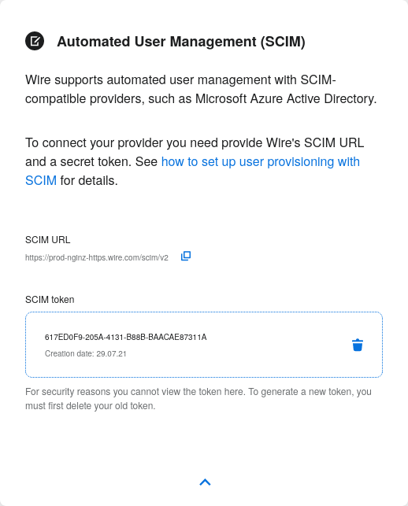
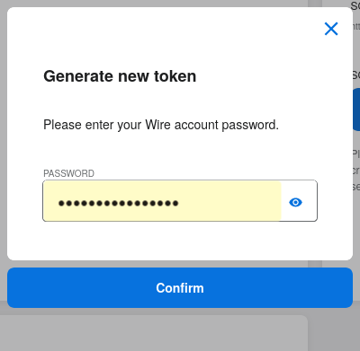

``TODO``: Import or reference design.rst somehow.

.. contents::
 
Introduction
============

This page is intended as a manual for administrator users in need of setting up :term:`SSO` and provisionning users using :term:`SCIM` on their installation of Wire.

TODO: Separate non-admin content into a different page for users only. Link to it here.

Historically and by default, Wire's user authentication method is via phone or password. This has security implications and does not scale.

Solution: :term:`SSO` with :term:`SAML`! `(Security Assertion Markup Language) <https://en.wikipedia.org/wiki/Security_Assertion_Markup_Language>`_

:term:`SSO` systems allow users to identify on multiple systems (including Wire once configured as such) using a single ID and password.

You can find some of the advantages of :term:`SSO` over more traditional schemes `here <https://en.wikipedia.org/wiki/Single_sign-on>`_.

Also historically, wire has allowed team admins and owners to manage their users in the team settings app.  

This does not scale as it requires a lot of manual labor for each user.

The solution we offer to solve this issue is implementing :term:`SCIM` `(System for Cross-domain Identity Management) <https://en.wikipedia.org/wiki/System_for_Cross-domain_Identity_Management>`_ (what's this?)

:term:`SCIM` is an interface that allows both software (for example Active Directory) and custom scripts to manage Identities (users) in "bulk".

This page explains how to set up :term:`SCIM` and then use it.


Definitions
===========

These concepts need to be understood to use the present manual:

TODO: Search-and-replace all terms from plain text to : term : ` TERM `

.. glossary::

   SCIM
       System for Cross-domain Identity Management (:term:`SCIM`) is a standard for automating the exchange of user identity information between identity domains, or IT systems.

       One example might be that as a company onboards new employees and separates from existing employees, they are added and removed from the company's electronic employee directory. :term:`SCIM` could be used to automatically add/delete (or, provision/de-provision) accounts for those users in external systems such as G Suite, Office 365, or Salesforce.com. Then, a new user account would exist in the external systems for each new employee, and the user accounts for former employees might no longer exist in those systems.   
      
       See: `System for Cross-domain Identity Management at Wikipedia <https://en.wikipedia.org/wiki/System_for_Cross-domain_Identity_Management>`_ 
      
       TODO: Context

   SSO
      
       Single sign-on (:term:`SSO`) is an authentication scheme that allows a user to log in with a single ID and password to any of several related, yet independent, software systems. 
      
       True single sign-on allows the user to log in once and access services without re-entering authentication factors. 
      
       See: `Single-Sign-On at Wikipedia <https://en.wikipedia.org/wiki/Single_sign-on>`_ 

   SAML

       Security Assertion Markup Language (:term:`SAML`, pronounced SAM-el, /ˈsæməl/) is an open standard for exchanging authentication and authorization data between parties, in particular, between an identity provider and a service provider. :term:`SAML` is an XML-based markup language for security assertions (statements that service providers use to make access-control decisions). :term:`SAML` is also:
    
       * A set of XML-based protocol messages
       * A set of protocol message bindings
       * A set of profiles (utilizing all of the above)
    
       An important use case that :term:`SAML` addresses is web-browser `single sign-on (:term:`SSO`) <https://en.wikipedia.org/wiki/Single_sign-on>`_ . Single sign-on is relatively easy to accomplish within a security domain (using cookies, for example) but extending :term:`SSO` across security domains is more difficult and resulted in the proliferation of non-interoperable proprietary technologies. The :term:`SAML` Web Browser `:term:`SSO` <https://en.wikipedia.org/wiki/Single_sign-on>`_ profile was specified and standardized to promote interoperability.
    
       See: `:term:`SAML` at Wikipedia <https://en.wikipedia.org/wiki/Security_Assertion_Markup_Language>`_

       TODO: Context

   IdP

       An identity provider (abbreviated :term:`IdP` or :term:`IdP`) is a system entity that creates, maintains, and manages identity information for principals and also provides authentication services to relying applications within a federation or distributed network.[1][2]
   
       Identity providers offer user authentication as a service. Relying party applications, such as web applications, outsource the user authentication step to a trusted identity provider. Such a relying party application is said to be federated, that is, it consumes federated identity.
   
       An identity provider is “a trusted provider that lets you use single sign-on (:term:`SSO`) to access other websites.”[3] :term:`SSO` enhances usability by reducing password fatigue. It also provides better security by decreasing the potential attack surface.
   
       Identity providers can facilitate connections between cloud computing resources and users, thus decreasing the need for users to re-authenticate when using mobile and roaming applications.[4] 
   
       See: `:term:`IdP` at Wikipedia <https://en.wikipedia.org/wiki/Identity_provider>`_ 

       TODO: Context (in relation to :term:`SCIM`) 


   Curl

       :term:`Curl` (pronounced ":term:`Curl`") is a command line tool used to download files over the HTTP (web) protocol. For example, ``:term:`Curl` http://wire.com`` will download the ``wire.com`` web page.
   
       In this manual, it is used to contact API (Application Programming Interface) endpoints manually, where those endpoints would normally be accessed by code or other software. 
   
       This can be used either for illustrative purposes (to "show" how the endpoints can be used) or to allow the manual execution of some simple tasks.
   
       For example (not a real endpoint) ``:term:`Curl` http://api.wire.com/delete_user/thomas`` would (schematically) execute the :term:`Curl` command, which would contact the wire.com API and delete the user named "thomas". 
   
       Running this command in a terminal would cause the ``:term:`Curl``` command to access this URL, and the API at that URL would execute the requested action.
   
       -- `:term:`Curl` at Wikipedia <https://en.wikipedia.org/wiki/Curl>`_


   Spar

       The Wire backend software stack is composed of different services, `running as pods </overview.html#focus-on-pods>`_ in a kubernetes cluster. 
   
       One of those pods is the "SPAR" service. That service/pod is dedicated to the providing :term:`SSO` and :term:`SCIM` services. This page is the manual for this service.

Wire comes with a backend module that provides :term:`SAML` single sign on and :term:`SCIM` user provisioning, called "Spar".

You're looking at the administrator's manual for this module.

.. note::
    Note that it is recommended to use both :term:`SSO` and :term:`SCIM` (as opposed to just :term:`SSO` alone). 
    The reason is if you only use :term:`SSO`, but do not configure/implement :term:`SCIM`, you will experience reduced functionality.
    In particular, without :term:`SCIM` all Wire users will be named according their e-mail address and won’t have any rich profiles.
    See below in the :term:`SCIM` section for a more detailled explanation.

User login for the first time with SSO
======================================

:term:`SSO` allows users to register and log into Wire with their company credentials that they use on other software in their workplace. 
No need to remember another password.

When a team is set up on Wire, the administrators can provide users a login code or link that they can use to go straight to their company’s login page.

Here is what this looks from a user's perspective:

* Download Wire.
* Select and copy the code that your company gave you / the administrator generated
* Open Wire.
  * Wire may detect the code on your clipboard and open a pop-up window with a text field. Wire will automatically put the code into the text field.
  * If so, click Log in and go to step 8.
* If no pop-up: click Login on the first screen.
* Click Enterprise Login.
* A pop-up will appear. In the text field, paste or type the code your company gave you.
* Click Log in.
* Wire will load your company’s login page: Log in with your company credentials.

TODO: Provide screenshots 

SAML/SSO
========

Introduction
------------

TODO: Do SSO introduction

Terminology and concepts
------------------------

* ``TODO``: Authentication request
* ``TODO``: Authentication response
* ``TODO``: How does the auth flow work (see ./design.rst)
* ``TODO``: [Everything we discuss in /how-to/single-sign-on/trouble-shooting.html, /how-to/single-sign-on/index.html]
* ``TODO``: [Everything that comes to mind while writing this manual]

IdP management (in team settings or via Curl)
---------------------------------------------

* ``TODO``: CRUD: Create, Read, Update, Delete in team-settings (some of it is not implemented, also document the :term:`Curl` way for everything?)
* ``TODO``: Deletion is tricky, but solved: the rest api end-point fails if the :term:`IdP` to be deleted is still authenticating active users in the team; but if you move all those users to other IdPs, you can delete it.  
* ``TODO``: There is also a `force` query parameter in the delete end-point that removes all dangling users instead of failing.  
* ``TODO``: What's to be decided is how to add that to team settings. 
* ``TODO``: Currently we need to fall back to the rest api for all this.


Authentication
--------------

* ``TODO``: This could be kind of the user's manual.
* ``TODO``: Or a summary of the user's manual plus a link, if we have it elsewhere. 
* ``TODO``: (``TODO``: talk to srikant and maybe astrid about the new documentation that's to replace support.wire.com, i heard rumors about that).

Setting up SSO externally
-------------------------

``TODO``: Integrate https://support.wire.com/hc/en-us/articles/360001285718-Set-up-SSO-externally

To set up :term:`SSO` for a given Wire installation, the Team owner/administrator must enable it.

The first step is to configure the Identity Provider: you'll need to register Wire as a service provider in your Identity Provider.

We've put together guides for registering with different providers:

* Instructions for Okta <../../how-to/single-sign-on/okta/main.rst>
* Instructions for Centrify <../../how-to/single-sign-on/centrify/main.rst>
* Instructions for Azure <../../how-to/single-sign-on/azure/main.rst>
* Some screenshots for ADFS <../../how-to/single-sign-on/adfs/main.rst>
* Generic instructions (try this if none of the above are applicable) <../../how-to/single-sign-on/generic-setup.rst>
* Trouble shooting & FAQ <../../how-to/single-sign-on/trouble-shooting.rst>

As you do this, make sure you take note of your :term:`IdP` metadata, which you will need for the next step.

TODO: Make sure each step explains about the :term:`IdP` metadata so this isn't confusing when getting here.

Once you are finished with registering Wire to your :term:`IdP`, move on to the next step, setting up :term:`SSO` internally.

TODO: This page is located in understand/, but it's really more of a how-to/ right? 

Setting up SSO internally
-------------------------

Now that you’ve registered Wire with your identity provider (:term:`IdP`), you can enable :term:`SSO` for your team on Wire.

On Desktop:

* Click Settings.
* Click Manage Team or go directly to teams.wire.com, or if you have an on-premise install, go to teams.<your-domain>.com
* Login with your account credentials.
* Click Customization. Here you will see the section for :term:`SSO`.
* Click the blue down arrow.
* Click Add :term:`SAML` Connection.
* Provide the :term:`IdP` metadata. To find out more about retrieving this for your provider, see the guides in the "Setting up :term:`SSO` externally" step just above.
* Click Save.
* Wire will now validate the document to set up the :term:`SAML` connection.
* If the data is valid, you will return to the Settings page.
* The page shows the information you need to log in with :term:`SSO`. Copy the login code or URL and send it to your team members or partners. For more information see: Logging in with :term:`SSO`.

TODO: Screenshots.

What to expect after :term:`SSO` is enabled: 

Anyone with a login through your :term:`SAML` identity provider (:term:`IdP`) and with access to the Wire app will be able to register and log in to your team using the :term:`SSO` Login URL and/or Code. 

Take care to share the code only with members of your team.

When your team members create accounts on Wire using :term:`SSO`, they will appear on the People tab of the team settings page.

If team members already have Wire accounts, they will need to create new ones by registering with the :term:`SSO` Login URL and/or Code. 

Existing Wire accounts cannot be bound to :term:`SSO` logins.

.. note::
   This section is a port of original instructions found at https://support.wire.com/hc/en-us/articles/360001285638-Set-up-SSO-internally

SCIM user provisioning
======================

Terminology and concepts
------------------------

``TODO``: - :term:`SCIM` peer (equivalent to :term:`IdP`)

SCIM peer management (in team settings or via Curl)
---------------------------------------------------

SCIM security and authentication
................................

* ``TODO``: We're using a very basic variant of oauth that just contains a header with a bearer token in all :term:`SCIM` requests. 
* ``TODO``: The token is created in team settings and added to your :term:`SCIM` peer somehow (see howtos or below (wherever we end up putting it) for Azure, :term:`Curl`).

Generating a SCIM token 
.......................

TODO: Notes from Lennart: In the current documentation I am missing the narrative. As a reader I would prefer a couple of sentences at the start explaining what the section is useful for. Example: it just says :term:`SCIM` peer mgmt, but when does the reader need this, and for what? Example 2: it says you need to provide a :term:`SCIM` token to your :term:`IdP` for user provisioning. I would like a sentence or two about how the :term:`IdP` uses the token and what info it conveys to the :term:`IdP`, and what the token contains for info.

These are the steps to generate a new :term:`SCIM` token, which you will need to provide to your identity provider (:term:`IdP`), along with the target API URL, to enable :term:`SCIM` provisionning.

* Step 1: Go to https://teams.wire.com/settings ( Here replace "wire.com" with your own domain if you have an on-premise installation of Wire ).



* Step 2: In the left menu, go to «Customization»



* Step 3: Go to «Automated User Management (:term:`SCIM`)»



* Step 4: Click the «down» arrow to expand



* Step 5: Click «Generate token», if your password is requested, enter it.



* Step 6: A token is generated, you can copy it



Tokens are now listed in this :term:`SCIM`-related area of the screen, you can generate up to 8 such tokens.

``TODO``: Add arrows/red lines to the images for even more precise instructions.

CRUD in team settings
.....................

``TODO``: Did we implement this fully? I think we may have:

* ``TODO``: We don't need the U in CRUD since we can just delete-and-recreate; and
* ``TODO``: We have just enough R for it to be secure (never expose the token after it's been handed over to the admin).

Using SCIM with azure
---------------------

``TODO``: We have a howto for :term:`SAML` i think we'll need another one for :term:`SCIM`.

Using SCIM via Curl
-------------------

``TODO``: See `wireapp/wire-server/docs/reference/provisioning/` on github.

You can use the ``:term:`Curl``` command line HTTP tool to access tho wire backend (in particular the ``SPAR`` service) through the :term:`SCIM` API. 

This can be helpful both to perform single operations manually, and as a tool to learn about the :term:`SCIM` API itself.

Creating a SCIM token 
.....................

Before we can send commands to the :term:`SCIM` API/Spar service, we need to be authenticated. This is done through the creation of a :term:`SCIM` token.

First, we need a little shell environment. Run the following in your terminal/shell:

.. code-block:: bash
   :linenos:

    export WIRE_BACKEND=https://prod-nginz-https.wire.com
    export WIRE_ADMIN=...
    export WIRE_PASSWD=...

Wire's SCIM API currently supports a variant of HTTP basic auth.  

In order to create a token in your team, you need to authenticate using your team admin credentials.  

The way this works behind the scenes in your browser or cell phone, and in plain sight if you want to use curl, is you need to get a Wire token.

First install the ``jq`` command (https://stedolan.github.io/jq/): 

.. code-block:: bash

    sudo apt install jq

.. note:: 

   If you don't want to install ``jq``, you can just call the ``curl`` command and copy the access token into the shell variable manually.

Then run: 

.. code-block:: bash
    :linenos:

    export BEARER=$(curl -X POST \
    --header 'Content-Type: application/json' \
    --header 'Accept: application/json' \
    -d '{"email":"'"$WIRE_ADMIN"'","password":"'"$WIRE_PASSWD"'"}' \
    $WIRE_BACKEND/login'?persist=false' | jq -r .access_token)

This token will be good for 15 minutes; after that, just repeat the command above to get a new token.

.. note::
    SCIM requests are authenticated with a SCIM token, see below. SCIM tokens and Wire tokens are different things. 
    
    A Wire token is necessary to get a SCIM token. SCIM tokens do not expire, but need to be deleted explicitly.

You can test that you are logged in with the following command: 

.. code-block:: bash

    curl -X GET --header "Authorization: Bearer $BEARER" $WIRE_BACKEND/self

Now you are ready to create a SCIM token:

.. code-block:: bash
    :linenos:

    export SCIM_TOKEN_FULL=$(curl -X POST \
    --header "Authorization: Bearer $BEARER" \
    --header 'Content-Type: application/json;charset=utf-8' \
    -d '{ "description": "test '"`date`"'", "password": "'"$WIRE_PASSWD"'" }' \
    $WIRE_BACKEND/scim/auth-tokens)
    export SCIM_TOKEN=$(echo $SCIM_TOKEN_FULL | jq -r .token)
    export SCIM_TOKEN_ID=$(echo $SCIM_TOKEN_FULL | jq -r .info.id)

The SCIM token is now contained in the ``SCIM_TOKEN`` environment variable.

You can look it up again with: 

.. code-block:: bash
    :linenos:

    curl -X GET --header "Authorization: Bearer $BEARER" \
    $WIRE_BACKEND/scim/auth-tokens

And you can delete it with:

.. code-block:: bash
    :linenos:

    curl -X DELETE --header "Authorization: Bearer $BEARER" \
    $WIRE_BACKEND/scim/auth-tokens?id=$SCIM_TOKEN_ID

Using a SCIM token to Create Read Update and Delete (CRUD) users
................................................................

Now that you have your SCIM token, you can use it to talk to the SCIM API to manipulate (create, read, update, delete) users, either individually or in bulk.

JSON encoding of SCIM Users
~~~~~~~~~~~~~~~~~~~~~~~~~~~

In order to manipulate users using commands, you need to specify user data.

A minimal definition of a user is written in JSON format and looks like this:

.. code-block:: json
    :linenos:

    {
       "schemas"     : ["urn:ietf:params:scim:schemas:core:2.0:User"],
       "externalId"  : "nick@example.com",
       "userName"    : "nick",
       "displayName" : "The Nick"
    }

You can store it in a variable using this sort of command:

.. code-block:: bash
    :linenos:

    export SCIM_USER='{
       "schemas"     : ["urn:ietf:params:scim:schemas:core:2.0:User"],
       "externalId"  : "nick@example.com",
       "userName"    : "nick",
       "displayName" : "The Nick"
    }'

The ``externalId`` is used to construct a SAML identity.  Two cases are
currently supported:

1. ``externalId`` contains a valid email address.  
   The SAML ``NameID`` has the form ``<NameID Format="urn:oasis:names:tc:SAML:1.1:nameid-format:emailAddress">me@example.com</NameID>``.
2. ``externalId`` contains anything that is *not* an email address.  
   The SAML ``NameID`` has the form ``<NameID Format="urn:oasis:names:tc:SAML:1.1:nameid-format:unspecified">...</NameID>``.

.. note::

    It is important to configure your SAML provider to use ``nameid-format:emailAddress`` or ``nameid-format:unspecified``.  Other nameid formats are not supported at this moment.

    See also: https://github.com/wireapp/wire-server/blob/c507ed64a7d4f0af2bffe2f9c3eb4b5f89a477c0/services/spar/src/Spar/Scim/User.hs#L149-L158

We also support custom fields that are used in rich profiles in this form (see: https://github.com/wireapp/wire-server/blob/develop/docs/reference/user/rich-info.md):

.. code-block:: bash
   :linenos:

    export SCIM_USER='{
      "schemas"     : ["urn:ietf:params:scim:schemas:core:2.0:User", "urn:wire:scim:schemas:profile:1.0"],
      "externalId"  : "rnick@example.com",
      "userName"    : "rnick",
      "displayName" : "The Rich Nick",
      "urn:wire:scim:schemas:profile:1.0": {
         "richInfo": [
            {
            "type": "Department",
            "value": "Sales & Marketing"
            },
            {
            "type": "Favorite color",
            "value": "Blue"
            }
         ]
      }
    }'

How to create a user
~~~~~~~~~~~~~~~~~~~~

You can create a user using the following command:

.. code-block:: bash
   :linenos:

    export STORED_USER=$(curl -X POST \
     --header "Authorization: Bearer $SCIM_TOKEN" \
     --header 'Content-Type: application/json;charset=utf-8' \
     -d "$SCIM_USER" \
     $WIRE_BACKEND/scim/v2/Users)
    export STORED_USER_ID=$(echo $STORED_USER | jq -r .id)

Note that ``$SCIM_USER`` is in the JSON format and is declared before running this commend as described in the section above.
   
Get a specific user
~~~~~~~~~~~~~~~~~~~

.. code-block:: bash
   :linenos:

    curl -X GET \
      --header "Authorization: Bearer $SCIM_TOKEN" \
      --header 'Content-Type: application/json;charset=utf-8' \
      $WIRE_BACKEND/scim/v2/Users/$STORED_USER_ID

Get all users
~~~~~~~~~~~~~

.. code-block:: bash
   :linenos:

    curl -X GET \
      --header "Authorization: Bearer $SCIM_TOKEN" \
      --header 'Content-Type: application/json;charset=utf-8' \
    $WIRE_BACKEND/scim/v2/Users/

Update a specific user
~~~~~~~~~~~~~~~~~~~~~~

For each put request, you need to provide the full json object.  All omitted fields will be set to ``null``.  (If you do not have an up-to-date user present, just ``GET`` one right before the ``PUT``.)

.. code-block:: bash
   :linenos:

    export SCIM_USER='{
      "schemas"     : ["urn:ietf:params:scim:schemas:core:2.0:User"],
      "externalId"  : "rnick@example.com",
      "userName"    : "newnick",
      "displayName" : "The New Nick"
    }'

.. code-block:: bash
   :linenos:

    curl -X PUT \
     --header "Authorization: Bearer $SCIM_TOKEN" \
     --header 'Content-Type: application/json;charset=utf-8' \
     -d "$SCIM_USER" \
     $WIRE_BACKEND/scim/v2/Users/$STORED_USER_ID

Delete user
~~~~~~~~~~~

.. code-block:: bash
   :linenos:

    curl -X DELETE \
      --header "Authorization: Bearer $SCIM_TOKEN" \
      $WIRE_BACKEND/scim/v2/Users/$STORED_USER_ID

.. note::
   To learn more, read the original Curl/SCIM documentation at: 
   * https://github.com/wireapp/wire-server/blob/develop/docs/reference/provisioning/SCIM-token.md
   * https://github.com/wireapp/wire-server/blob/develop/docs/reference/provisioning/SCIM-via-Curl.md
   If you want to dive into the backend code, start `reading here in our backend <https://github.com/wireapp/wire-server/blob/develop/services/spar/src/Spar/SCIM.hs>`_ and `our hSCIM library <https://github.com/wireapp/hSCIM>`_.

SCIM + SSO
==========

``TODO``: Using :term:`SAML` :term:`SSO` without :term:`SCIM` is deprecated:

* ``TODO``: 1. :term:`SAML` does not have a good update / deprovisioning story
* ``TODO``: 2. Presenting users with attributes is not implemented in spar, because:
* ``TODO``: 3. The :term:`SAML` standard is very dated and has dubious security properties (``TODO``: dig up one of the many beautiful xml-dsig rants out there), should be considered legacy, and be used a little as possible.

``TODO``: So the recommended setup is :term:`SAML` + :term:`SCIM`, and Oauth + :term:`SCIM` as soon as we have released the latter.

Corner cases
------------

``TODO``: Why can't i disable :term:`SSO` once it's enabled? -> need implementing.  

``TODO``: In order for this to work, we need to double-check that no :term:`SSO` users are still active in this team.

``TODO``: Hundreds and hundreds of corner cases:

* ``TODO``: You can't auto-provision users if :term:`SCIM` tokens exist.
* ``TODO``: What happens if a user is created with :term:`SSO` auto-provisioning, then a :term:`SCIM` token is created, and the user is now under :term:`SCIM` management?  (*probably* all sound and good.)
* ``TODO``: What happens if the last :term:`SCIM` token is removed, and users are still under :term:`SCIM` management?  (possibly a bug.)
* ``TODO``: ...

``TODO``: IDEA: This is the section that'll potentially be most valuable, but i think the way to proceed is to cover the general idea first, publish that, and then publish incremental progress on this advanced part of the manual as we make it.
